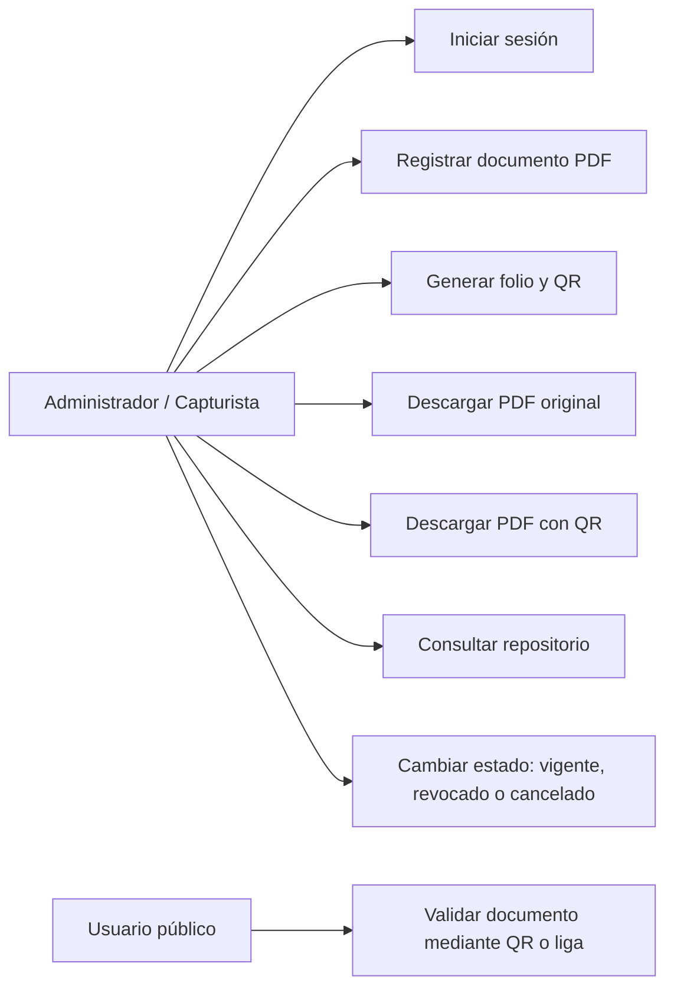
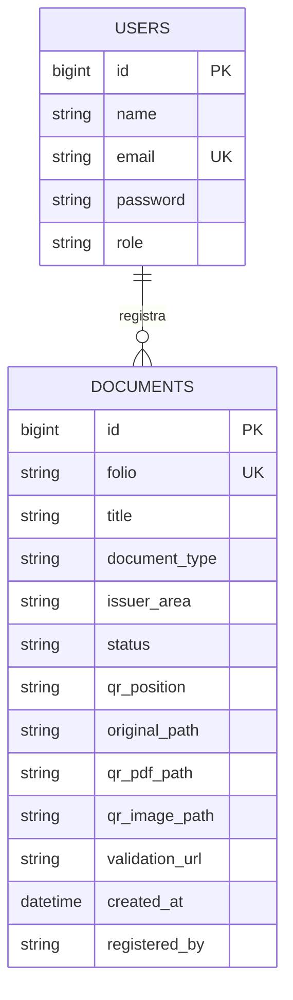

# Diagramas del proyecto VALIDOC

## Diagrama de caso de uso

```mermaid
flowchart LR
  A[Administrador / Capturista] --> L[Iniciar sesión]
  A --> R[Registrar documento PDF]
  A --> G[Generar folio y QR]
  A --> D[Descargar PDF original]
  A --> Q[Descargar PDF con QR]
  A --> C[Consultar repositorio]
  A --> E[Cambiar estado: vigente, revocado o cancelado]
  P[Usuario público] --> V[Validar documento mediante QR o liga]
```

## Diagrama entidad-relación

```mermaid
erDiagram
  USERS ||--o{ DOCUMENTS : registra
  USERS {
    bigint id PK
    string name
    string email UK
    string password
    string role
  }
  DOCUMENTS {
    bigint id PK
    string folio UK
    string title
    string document_type
    string issuer_area
    string status
    string qr_position
    string original_path
    string qr_pdf_path
    string qr_image_path
    string validation_url
    datetime created_at
    string registered_by
  }
```
